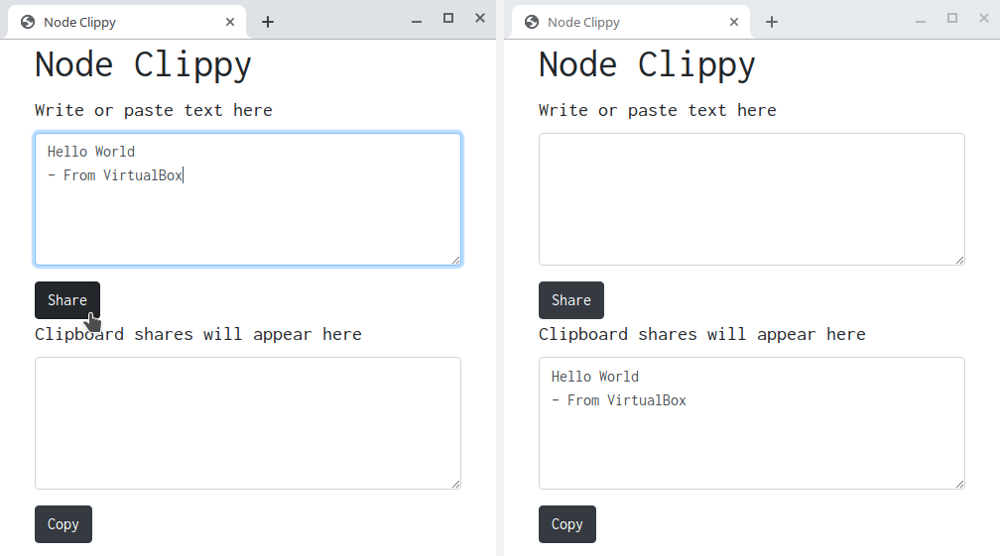

# Node-Clippy

Websocket based clipboard-sharing tool, to be used across a network.

> This app might seem useless but I use it more often when I cannot enable bidirectional clipboard sharing between my VirtualBox VMs and host.

## How To

* Do `npm i`
* Then `npm start`
* Visit `http://localhost:3000` or `http://ip-of-computer:3000`

## Screenshot

